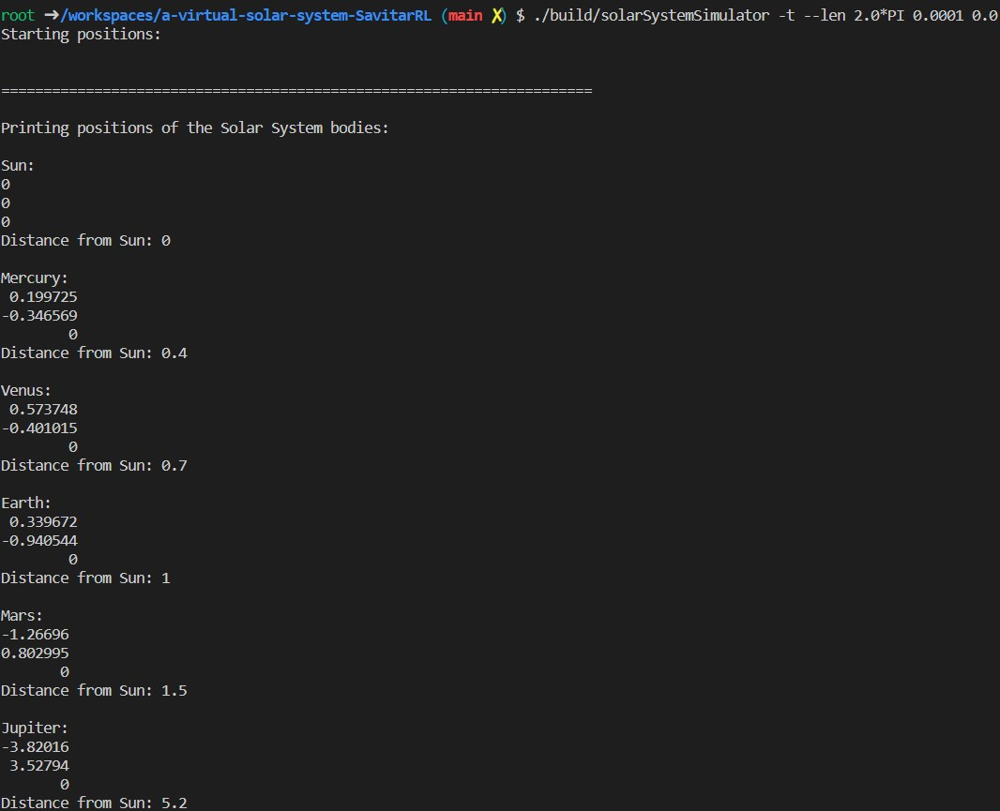
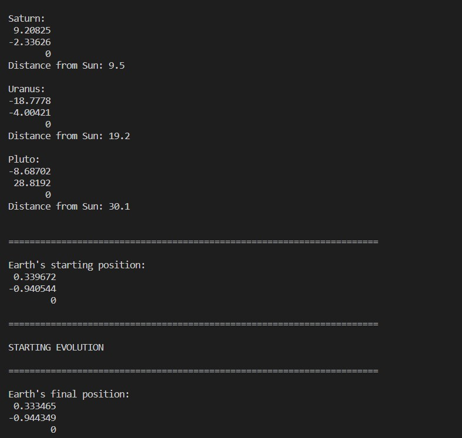
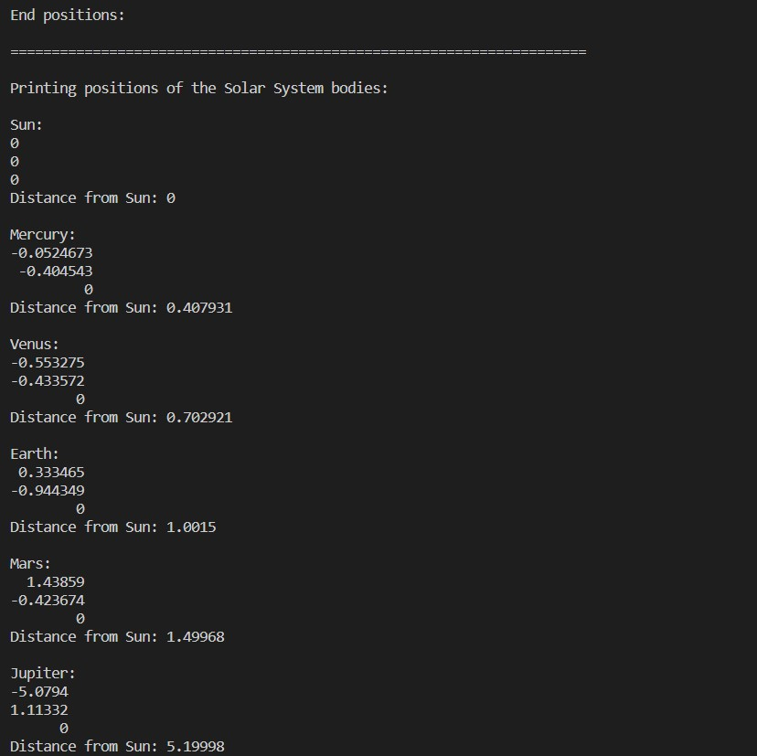
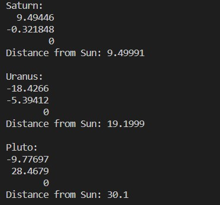

# A Virtual Solar System

This is the starting repository for assignment 2 of Research Computing with C++. You may add or remove C++ files in any directory. You should organise the files as you see fit but do read the Folder Structure section below to understand the intended use of the existing folders.

## Installing dependencies

We are using the package manager Conan to install the dependencies Catch2 and Eigen. In order to use CMake's `Release` target for performance and `Debug` for debugging, the libraries must be installed twice with:

```
conan install . --output-folder=build --build=missing -s build_type=Debug
conan install . --output-folder=build --build=missing -s build_type=Release
```

If you delete the `build` directory to clean your build, you may have to install the dependencies again.

## Building

To build from the project root directory you should run:

```
cmake -S . -B build -DCMAKE_BUILD_TYPE=Release
cmake --build build
```

If you wish to debug your code, you should replace `Release` with `Debug`. For performance measurements, ensure you have built with the `Release` target.

## Testing

Once the project has been built, it can be tested by running:

```
cd build
./test
```

## Folder structure

The project is split into four main parts aligning with the folder structure described in [the relevant section in Modern CMake](https://cliutils.gitlab.io/modern-cmake/chapters/basics/structure.html):

- `app/` contains all code implementing the command-line application.
- `lib/` contains all non-app code. Only code in this directory can be accessed by the unit tests.
- `include/` contains all `.hpp` files.
- `test/` contains all unit tests.

You are expected to edit the `CMakeLists.txt` file in each folder to add or remove sources as necessary. For example, if you create a new file `test/particle_test.cpp`, you must add `particle_test.cpp` to the line `add_executable(tests test.cpp)` in `test/CMakeLists.txt`. Please ensure you are comfortable editing these files well before the submission deadline. If you feel you are struggling with the CMake files, please see the Getting Help section of the assignment instructions.

## Brief Description and User Instructions

----------------
----------------
## Section 1  to Section 2.3:
## Solar System Simulator, Calculating Numerical Energy Loss and Increasing the scale of the system
### Unit Tests
All unit tests are written within *test/test.cpp* (all passed)

Tests for each section (e.g. section 1.1) are indicated within this file for clarity.

To run tests for code regarding this section:
```
./build/tests
```
To run individual test sections with filters
```
./build/tests [SS_get_masses]
```
### Code Implementation
All classes in this assignment are written in *include/particle.hpp* and *src/particle.cpp*. The command-line application is written in *app/main.cpp*.

### Command Line Application
For the command line application, run the below to show the detailed help message, which will direct you to using the application:

```
./build/solarSystemSimulator 
```
or
```
./build/solarSystemSimulator -h
```
Printing the help message on how to run the application (scaling of the window may affect the "appearance" and spacings of the help message):

```
Showing help message: 


Usage: ./build/solarSystemSimulator [-h] [--help] [-t --len <len_time> <timesteps> <epsilon>] [-t --num <num_timesteps> <timesteps> <epsilon>]
                                    [-tel <len_time> <timesteps> <epsilon> <num_diff_times>] [-gel <len_time> <timesteps> <epsilon> <num_planets>]

Options:

Commands and Description

-h | --help 
Shows this help message.

-t --len <len_time> <timesteps> <epsilon> 
Controlling the timestep dt and the total length of time, with softening factor epsilon.

-t --num <num_timesteps> <timesteps> <epsilon> 
Controlling the timestep dt and the total number of timesteps to simulate, with softening factor epsilon.

-tel <len_time> <max_timestep> <epsilon> <num_diff_times>
Showing the energy before and after, as well as the energy loss for different timesteps, for the evolution of controlling the timestep dt and the total number of timesteps to simulate, with softening factor epsilon. The maximum timestep is the maximum value of the timestep dt, and there will be num_diff_times of such dt, each with decreasing orders of 10 starting from the maximum dt. The time taken for the loop to run will also be printed in a summary table.

-gel <len_time> <timesteps> <epsilon> <num_planets>
Showing the total energy loss for the simulation of a general solar system with num_planets many planets with softening factor epsilon. The general solar system will run for total time of len_time with timesteps dt. Positions and masses of bodies inside the syetem are always randomised. The time taken for the application to run will be printed on a summary table.

Arguments are separated by a single whitespace.


Variable explanations:

        <len_time>               The total length of time to simulate the evolution of the solar system. (type: float)
        <num_timesteps>          The total number of timesteps to simulate the evolution of the solar system. (type: integer)
        <timesteps>              The timestep dt to evolve the solar system (type: float)
        <max_timestep>           The maximum timestep to evolve the solar system (type: float)
        <epsilon>                Softening factor when calculating the acceleration. (type: float)
        <num_diff_times>         Number of different timesteps to calculate and compare the solar system energies for each of these timesteps. (type: int)
        <num_planets>            Number of planets in the general solar system. (type: int)


**NOTE**: Usage of π=3.14159265... , please input <constant>*PI or <constant>*pi, where <constant> is any number of type float or integer.

 
Example inputs:

-h  
Shows this help message

-t --len 2.0*PI 0.0001 0.0 
Evolving the solar system with a total time of 2π with timestep dt = 0.0001, with softening factor of epsilon = 0.0 .

-t --num 400 0.01 0.001 
Evolving the solar system with 400 timesteps with timestep dt = 0.01, , with softening factor of epsilon = 0.001 .

-tel 200.0*PI 10.0 0.0 5 
Showing the energy before and after, as well as the total energy loss for the evolution of the solar system with a total time of 200π with timestep dt, with softening factor of epsilon = 0.0. There are 5 different timesteps for this run, which are dt = 10, 1, 0.1, 0.01, 0.001

-gel 200.0*PI 0.001 0.1 64 
Showing the the total energy loss for the evolution of a general solar system with a total time of 200π with timestep dt=0.001, with softening factor of epsilon = 0.1. There are 64 planets in this general solar system, where their masses, distance from sun and orientation from the sun are randomised.


**NOTE** Scaling of this application: 
Units are all scaled so that the central star's (e.g. Sun in our solar system) mass is 1. For the solar system specifically, the distance between the Sun and the Earth is 1(AU).
Using this scaling, the Earth will travel around the Sun exactly once every 2π. (i.e. one year corresponds to a time of 2π)
```


### Solar System Simulation
----------------

### Implementation

Run the following to simulate our own solar system
```
./build/solarSystemSimulator -t --len 2.0*PI 0.0001 0.0
```
Below is an example output. Results may differ due to randomly initiated angles. 







You may specifically see that the Earth's original and final position after a time of  $2\pi$ (i.e. one year) is very close, which means the simulation is correct.


### Numerical Energy Loss and Performance (2.1) and Benchmarking Simulation (2.2)
Run the following to see the numerical energy loss and performance:
```
./build/solarSystemSimulator -tel 200.0*PI 100.0 0.0 8 
```
This will show the energy before and after, as well as the total energy loss for the evolution of the solar system with a total time of 200π with timestep dt, with softening factor of epsilon = 0.0. There are 8 different timesteps for this run, which are dt = 100, 10, 1, 0.1, 0.01, 0.001, 0.0001, 0.00001. 

To toggle with and without optimisations: go to the root directory *CMakeLists.txt* and comment out either: 
```
add_compile_options(-O0) 
```

or

```
add_compile_options(-O2)
```
depending which one you need. (Of course do not comment out the one you need.)

Simulations without optimisation

%20no%20opt.jpg)

Simulations with optimisation

%20have%20opt.jpg)

We can clearly see that for very large time steps, the energy loss is quite significant. As we increase the steps of the timestep dt, more time is required as expected. With optimisation, the runtime is much less when comparing the time results without optimisation. 

### General Solar System Simulations 
An example input would be the following:
```
./build/solarSystemSimulator -gel 200.0*PI 0.001 0.1 64 
```
This shows the total energy loss for the evolution of a general solar system with a total time of 200π with timestep dt=0.001, with softening factor of epsilon = 0.1. There are 64 planets in this general solar system, where their masses, distance from sun and orientation from the sun are randomised. 

#### Increasing scale of Simulation (2.3)

The following is an example out of the random initial generator  initialising simulations with 8, 64, 256, 1024 and 2048 particles and simulating them with a total time of $200\pi$, with timestep 0.01 and epsilon = 0.001. Optimisation is turned on (with -O2). The inputs and outputs are shown in the following screenshot:


#### Parallelising using OpenMP

The for loop within the following functions has been parallelised (see code in *particle.cpp*)
1. Particle::CalculateTotalAcceleration --> using *#pragma omp parallel for reduction*
2. Particle::PotentialEnergy --> *using #pragma omp parallel for*
3. SolarSystem::TimeEvolve --> using *#pragma omp parallel for ordered* and *#pragma omp parallel for*
4. RandomInitialGenerator::GenerateInitialConditions --> using *    #pragma omp parallel for ordered*

If one wishes not to parallelise it, just comment out the lines with *#pragma*. 

The input below completes the task for 2.4(a). 
```
./build/solarSystemSimulator -gel 2 0.001 0.1 2048
```
Before parallelisation, the code runs for about 5 min:

%20no%20para.jpg)

 After it, the code runs for also around 5 min, as shown in the screenshot below:

%20have_para.jpg)

For the *collapse* clause, there is no where in the code to include *#pragma omp parallel for collapse(2)* is added inside the function.

For the *schedule* clause, *#pragma omp parallel for schedule(static)* is added inside stated functions with *#pragma omp parallel for* (2. Particle::PotentialEnergy and 3. SolarSystem::TimeEvolve), basically replacing it. (You may remove *schedule(static)* if you wish to only keep the *pragma omp parallel for* line. )The screenshot of the output is as follows:

%20have_para%20(schedule%20static).jpg)

## Credits

This project is maintained by Dr. Jamie Quinn as part of UCL ARC's course, Research Computing in C++.
-----------------
-----------------

This assignment is done and completed by Pak To Lau Ryan 

